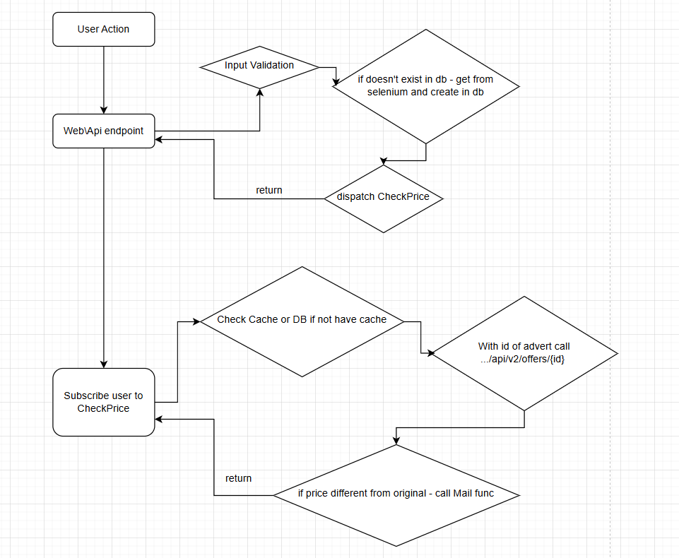

# Price Observer 🚀

## 📌 Overview
Price Observer is a Laravel-based price tracking system that periodically checks the prices of listed advertisements on **OLX** and updates the users if the price changes. The system utilizes **Laravel Horizon** for managing background jobs and runs a scheduled task that scrapes the OLX API every 5 minutes.

## ✅ Implemented Solution
The project was initially designed to use **Supervisor**, but we switched to **Laravel Horizon** to handle background job processing efficiently. Additionally:
- **Caching**: We cache prices to reduce redundant API calls.
- **Queue Processing**: We use Redis and Laravel Horizon to handle asynchronous tasks.
- **Job Scheduling**: Scraping jobs run every **5 minutes**.
- **Containerized Environment**: The project runs in **Docker with Laravel Sail**.

---

## ⚙️ Functionality
- **User-Advert Tracking**: Each user can track multiple advertisements.
- **Automated Price Checking**: Fetches prices from OLX via API.
- **Caching Mechanism**: Stores fetched prices to prevent redundant API requests.
- **Price Change Detection**: Notifies users when the price changes.
- **Queue Job Processing**: Uses **Laravel Horizon** to manage background jobs efficiently.
- **Dockerized Deployment**: Runs seamlessly inside Docker using Laravel Sail.

---

## Diagram 


## 🚀 How to Run

### **1️⃣ Clone the Repository**
```sh
git clone https://github.com/xmdn/price_observer.git
cd price_observer


